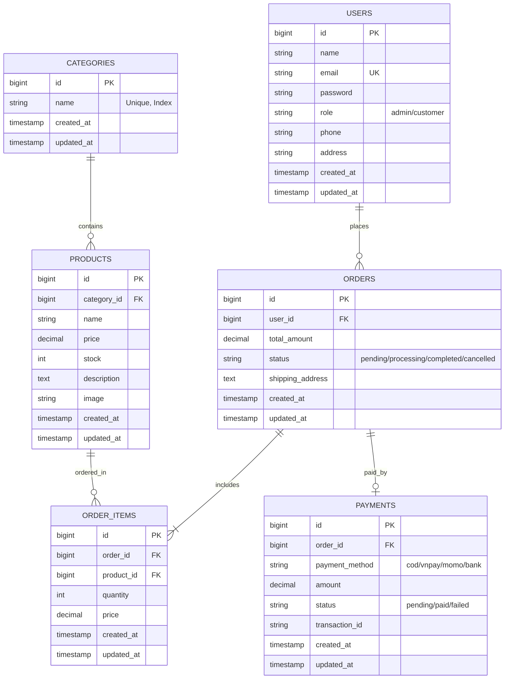

# BÁO CÁO & TÀI LIỆU KỸ THUẬT DỰ ÁN THƯƠNG MẠI ĐIỆN TỬ (TMDT)

## 📌 1. TỔNG QUAN DỰ ÁN
* **Tên dự án:** Hệ thống Website Thương mại Điện tử (E-Commerce Web Application)
* **Học phần:** Thương mại điện tử (TMDT)
* **Công nghệ cốt lõi:**
  * **Backend:** PHP 8.3 + Laravel Framework 11/12
  * **Kiến trúc:** Thin Controller - Service Layer - Form Request Validation - Repository/Eloquent ORM
  * **Database:** MySQL Server 8.0 (Database: `ecommerce2024`)
  * **Frontend & UI:** Blade Template, Bootstrap 5.3, Bootstrap Icons, Plus Jakarta Sans Typography, Dedicated CSS Custom Tokens.

---

## 🏛️ 2. KIẾN TRÚC MÃ NGUỒN (ENTERPRISE ARCHITECTURE)

Dự án được tổ chức chặt chẽ theo mô hình đa tầng (Layered Architecture):

```text
               ┌──────────────────────────────┐
               │    HTTP Request (Client)     │
               └──────────────┬───────────────┘
                              │
               ┌──────────────▼───────────────┐
               │   Routes (routes/web.php)    │
               └──────────────┬───────────────┘
                              │
               ┌──────────────▼───────────────┐
               │    Form Request Validation   │
               │   (Store / Update Category)  │
               └──────────────┬───────────────┘
                              │
               ┌──────────────▼───────────────┐
               │       Thin Controller        │
               │    (CategoryController.php)  │
               └──────────────┬───────────────┘
                              │
               ┌──────────────▼───────────────┐
               │        Service Layer         │
               │    (CategoryService.php)     │
               └──────────────┬───────────────┘
                              │
               ┌──────────────▼───────────────┐
               │      Eloquent ORM Model      │
               │        (Category.php)        │
               └──────────────┬───────────────┘
                              │
               ┌──────────────▼───────────────┐
               │    MySQL Database Engine     │
               └──────────────────────────────┘
```

### Chi tiết các tầng logic:
1. **`app/Constants/AppConstants.php`**: Chứa toàn bộ hằng số hệ thống (Pagination limits, Flash keys, Message strings) nhằm triệt tiêu Magic Numbers / Magic Strings.
2. **`app/Http/Requests/Category/`**: Đóng gói validation rules, unique constraints và thông báo lỗi tiếng Việt độc lập với Controller.
3. **`app/Services/CategoryService.php`**: Xử lý logic nghiệp vụ và thao tác dữ liệu.
4. **`app/Http/Controllers/CategoryController.php`**: Nhận request, điều phối Service và trả về View tương ứng.
5. **`resources/views/components/`**: Các UI Component dùng chung (`<x-navbar />`, `<x-alert />`).
6. **`public/css/custom.css`**: Design tokens chuẩn quốc tế (`:root { --primary-color: ... }`).

---

## 🗄️ 3. MÔ HÌNH CƠ SỞ DỮ LIỆU (DATABASE SCHEMA)

Hệ thống được thiết kế hoàn chỉnh gồm 6 bảng thực thể quan hệ:



---

## 🚀 4. HƯỚNG DẪN KHỞI CHẠY 1-CLICK

### Cách 1: Chạy file script tự động (Khuyên dùng)
* Nhấp đúp chuột vào file **`start.bat`** (hoặc chạy `./start.ps1` trong PowerShell).
* Script sẽ tự động thiết lập môi trường, kiểm tra MySQL80, nạp database và khởi động web server.

### Cách 2: Chạy bằng dòng lệnh thủ công
1. Đảm bảo dịch vụ **MySQL80** đã bật trong Windows Services (`services.msc`).
2. Mở Terminal tại thư mục dự án `D:\Work\Study\TMDT` và chạy:
```powershell
$env:PATH = "C:\laragon\bin\php\php-8.3.30-Win32-vs16-x64;C:\laragon\bin\composer;C:\Program Files\MySQL\MySQL Server 8.0\bin;" + $env:PATH

# Chạy Migration và nạp dữ liệu mẫu
php artisan migrate --seed

# Khởi chạy Server
php artisan serve
```

---

## 🌐 5. DANH SÁCH ROUTES & ENDPOINTS (CRUD CATEGORIES)

| Method | URI Endpoint | Action / Controller | Mô tả chức năng |
| :--- | :--- | :--- | :--- |
| `GET` | `/` | `Redirect` | Tự động chuyển hướng về `/categories` |
| `GET` | `/categories` | `CategoryController@index` | Trang danh sách danh mục (có phân trang) |
| `GET` | `/categories/create` | `CategoryController@create` | Form thêm danh mục mới |
| `POST` | `/categories` | `CategoryController@store` | Xử lý lưu danh mục mới vào CSDL |
| `GET` | `/categories/{id}` | `CategoryController@show` | Xem chi tiết thông tin 1 danh mục |
| `GET` | `/categories/{id}/edit` | `CategoryController@edit` | Form chỉnh sửa danh mục |
| `PUT` | `/categories/{id}` | `CategoryController@update` | Cập nhật thông tin danh mục |
| `DELETE`| `/categories/{id}` | `CategoryController@destroy` | Xóa danh mục khỏi hệ thống |

---

## 📸 6. HƯỚNG DẪN CHỤP ẢNH BÁO CÁO LAB
1. **Ảnh 1:** Quá trình chạy lệnh `php artisan migrate --seed` trong Terminal.
2. **Ảnh 2:** Bảng `categories` hiển thị trong MySQL Workbench / HeidiSQL với các dữ liệu mẫu đã seed.
3. **Ảnh 3:** Trang danh sách danh mục `http://127.0.0.1:8000/categories`.
4. **Ảnh 4:** Form thêm mới danh mục `http://127.0.0.1:8000/categories/create` (và ảnh hiển thị validate khi để trống).
5. **Ảnh 5:** Form chỉnh sửa danh mục `http://127.0.0.1:8000/categories/{id}/edit`.
6. **Ảnh 6:** Trang xem chi tiết danh mục `http://127.0.0.1:8000/categories/{id}`.
