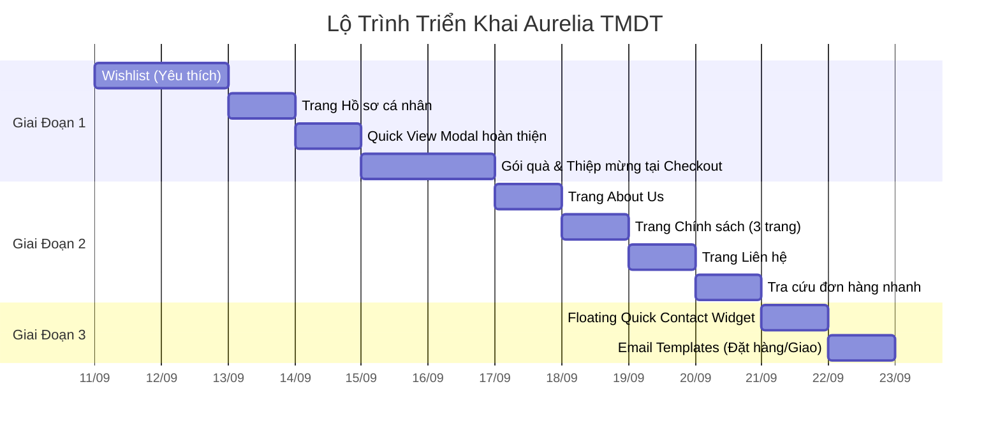

# Kế Hoạch Triển Khai Toàn Diện — Aurelia Luxury Bags TMDT

Nâng cấp sàn TMDT túi xách nữ từ MVP lên nền tảng thương mại điện tử hoàn chỉnh, chuyên nghiệp, mang lại trải nghiệm WOW cho khách hàng nữ.

---

## Lộ Trình 3 Giai Đoạn



---

## GIAI ĐOẠN 1 — Trải Nghiệm Mua Hàng Hoàn Hảo

---

### Feature 1: Wishlist (Danh sách yêu thích / Thả tim lưu mẫu túi)

**Mô tả:** Cho phép khách hàng đăng nhập bấm nút trái tim để lưu sản phẩm yêu thích. Hiển thị trang quản lý wishlist cá nhân tại `/account/wishlist`.

#### [NEW] Migration: `create_wishlists_table`
- Tạo bảng `wishlists`:
  - `id` (PK), `user_id` (FK → users), `product_id` (FK → products)
  - Unique constraint: `(user_id, product_id)` — mỗi user chỉ thả tim 1 lần/sản phẩm
  - `created_at`, `updated_at`

#### [NEW] Model: [`Wishlist.php`](file:///d:/Work/Study/TMDT/app/Models/Wishlist.php)
- `fillable`: `user_id`, `product_id`
- Relationships: `belongsTo(User)`, `belongsTo(Product)`

#### [MODIFY] Model: [`User.php`](file:///d:/Work/Study/TMDT/app/Models/User.php)
- Thêm relationship `wishlists()` → `hasMany(Wishlist::class)`
- Thêm method `hasWishlisted(Product $product): bool`

#### [MODIFY] Model: [`Product.php`](file:///d:/Work/Study/TMDT/app/Models/Product.php)
- Thêm relationship `wishlists()` → `hasMany(Wishlist::class)`

#### [NEW] Service: [`WishlistService.php`](file:///d:/Work/Study/TMDT/app/Services/WishlistService.php)
- `toggle(int $userId, int $productId): array` — thêm/xóa khỏi wishlist (toggle)
- `getUserWishlist(int $userId): Collection` — lấy danh sách wishlist có eager load product
- `isWishlisted(int $userId, int $productId): bool`
- `getWishlistCount(int $userId): int`

#### [NEW] Controller: [`WishlistController.php`](file:///d:/Work/Study/TMDT/app/Http/Controllers/WishlistController.php)
- `index()` → Hiển thị trang `/account/wishlist` (Blade view)
- `toggle(Product $product)` → JSON response toggle (AJAX) — `POST /wishlist/toggle/{product}`
- `remove(Product $product)` → Xóa khỏi wishlist — `DELETE /wishlist/{product}`

#### [NEW] View: [`account/wishlist.blade.php`](file:///d:/Work/Study/TMDT/resources/views/account/wishlist.blade.php)
- Grid hiển thị các sản phẩm đã thả tim (tái sử dụng product card component)
- Nút "Thêm vào giỏ hàng" cho từng item
- Nút "Xóa khỏi yêu thích"
- State rỗng khi chưa có sản phẩm nào

#### [MODIFY] Views: Thêm nút trái tim vào product cards
- [`storefront/index.blade.php`](file:///d:/Work/Study/TMDT/resources/views/storefront/index.blade.php) — Hero featured products
- [`storefront/shop.blade.php`](file:///d:/Work/Study/TMDT/resources/views/storefront/shop.blade.php) — Shop grid
- [`storefront/show.blade.php`](file:///d:/Work/Study/TMDT/resources/views/storefront/show.blade.php) — Product detail page
- Icon trái tim ở góc trên bên phải ảnh sản phẩm, bấm toggle AJAX

#### [MODIFY] Layout: [`layouts/storefront.blade.php`](file:///d:/Work/Study/TMDT/resources/views/layouts/storefront.blade.php)
- Thêm link "Yêu thích" trong user dropdown menu (cạnh "Đơn hàng của tôi")
- Thêm icon trái tim + badge count trên header (cạnh icon giỏ hàng)

#### [MODIFY] Routes: [`routes/web.php`](file:///d:/Work/Study/TMDT/routes/web.php)
- Thêm routes wishlist trong group `auth`:
  - `GET /account/wishlist` → `WishlistController@index`
  - `POST /wishlist/toggle/{product}` → `WishlistController@toggle`
  - `DELETE /wishlist/{product}` → `WishlistController@remove`

#### [MODIFY] Constants: [`RouteConstants.php`](file:///d:/Work/Study/TMDT/app/Constants/RouteConstants.php)
- Thêm hằng số route cho Wishlist

---

### Feature 2: Trang Hồ sơ cá nhân (Profile Settings)

**Mô tả:** Trang `/account/profile` cho phép user cập nhật tên, số điện thoại, ngày sinh, ảnh đại diện (avatar URL), và đổi mật khẩu.

#### [NEW] Migration: `add_profile_fields_to_users_table`
- Thêm vào bảng `users`:
  - `phone` (varchar 20, nullable)
  - `birthday` (date, nullable) — cho tính năng voucher sinh nhật sau này
  - `avatar` (varchar 500, nullable) — URL ảnh đại diện

#### [MODIFY] Model: [`User.php`](file:///d:/Work/Study/TMDT/app/Models/User.php)
- Thêm `phone`, `birthday`, `avatar` vào `Fillable` attribute
- Thêm cast: `'birthday' => 'date'`

#### [NEW] FormRequest: [`UpdateProfileRequest.php`](file:///d:/Work/Study/TMDT/app/Http/Requests/Account/UpdateProfileRequest.php)
- Validate: name (required), phone (regex VN), birthday (date, before:today), avatar (url, nullable)

#### [NEW] FormRequest: [`ChangePasswordRequest.php`](file:///d:/Work/Study/TMDT/app/Http/Requests/Account/ChangePasswordRequest.php)
- Validate: current_password (required, current_password rule), password (confirmed, min:8)

#### [MODIFY] Controller: [`AccountController.php`](file:///d:/Work/Study/TMDT/app/Http/Controllers/AccountController.php)
- Thêm method `profile()` → hiển thị form profile
- Thêm method `updateProfile(UpdateProfileRequest)` → cập nhật thông tin
- Thêm method `changePassword(ChangePasswordRequest)` → đổi mật khẩu

#### [NEW] View: [`account/profile.blade.php`](file:///d:/Work/Study/TMDT/resources/views/account/profile.blade.php)
- Form chỉnh sửa: Avatar (hiển thị initials nếu chưa có), Tên, Email (readonly), Phone, Ngày sinh
- Section đổi mật khẩu riêng biệt
- Design thống nhất với các trang account khác (orders, addresses, coins)

#### [MODIFY] Layout: [`layouts/storefront.blade.php`](file:///d:/Work/Study/TMDT/resources/views/layouts/storefront.blade.php)
- Thêm link "Hồ sơ cá nhân" vào user dropdown menu

#### [MODIFY] Routes & Constants
- `GET /account/profile` → `AccountController@profile`
- `PUT /account/profile` → `AccountController@updateProfile`
- `PUT /account/password` → `AccountController@changePassword`

---

### Feature 3: Gói quà & Thiệp mừng tại Checkout

**Mô tả:** Tại trang checkout, khách hàng có thể chọn dịch vụ gói quà hộp cứng cao cấp (+35.000₫) và/hoặc viết lời chúc trên thiệp miễn phí.

#### [NEW] Migration: `add_gift_options_to_orders_table`
- Thêm vào bảng `orders`:
  - `is_gift_wrapped` (boolean, default false)
  - `gift_wrap_fee` (decimal 12,2, default 0)
  - `gift_message` (text, nullable) — nội dung thiệp chúc mừng
  - `hide_price` (boolean, default false) — giấu hóa đơn giá tiền

#### [MODIFY] Model: [`Order.php`](file:///d:/Work/Study/TMDT/app/Models/Order.php)
- Thêm `is_gift_wrapped`, `gift_wrap_fee`, `gift_message`, `hide_price` vào fillable & casts

#### [MODIFY] FormRequest: [`ProcessCheckoutRequest.php`](file:///d:/Work/Study/TMDT/app/Http/Requests/Checkout/ProcessCheckoutRequest.php)
- Thêm validation rules cho `is_gift_wrapped`, `gift_message`, `hide_price`

#### [MODIFY] Service: [`OrderService.php`](file:///d:/Work/Study/TMDT/app/Services/OrderService.php)
- Trong `createOrder()`: xử lý gift_wrap_fee cộng vào tổng, lưu gift_message

#### [MODIFY] View: [`checkout/index.blade.php`](file:///d:/Work/Study/TMDT/resources/views/checkout/index.blade.php)
- Thêm section "Dịch vụ Gói quà & Thiệp mừng" trước phần tổng tiền:
  - Checkbox gói quà hộp cứng nơ lụa (+35.000₫) — JS tự cộng phí
  - Textarea nhập lời chúc (max 200 ký tự, hiển thị đếm ký tự)
  - Checkbox "Giấu hóa đơn giá tiền khi giao hàng"

#### [MODIFY] View: [`account/order-detail.blade.php`](file:///d:/Work/Study/TMDT/resources/views/account/order-detail.blade.php)
- Hiển thị thông tin gói quà & thiệp nếu đơn hàng có sử dụng

---

## GIAI ĐOẠN 2 — Trang Thông Tin & Chính Sách

---

### Feature 4: Trang Giới thiệu (About Us)

#### [NEW] View: [`storefront/about.blade.php`](file:///d:/Work/Study/TMDT/resources/views/storefront/about.blade.php)
- **Câu chuyện thương hiệu Aurelia** — giới thiệu sứ mệnh, tầm nhìn, giá trị
- **Quy trình sản xuất** — từ tuyển chọn da → thiết kế → may thủ công → kiểm chất lượng
- **Đội ngũ** (placeholder — có thể dùng ảnh stock hoặc generate)
- **Con số ấn tượng**: 500+ khách hài lòng, 1000+ mẫu túi, 12 tháng bảo hành
- Design: Full-width hero image, alternating text/image sections, parallax scroll

#### [MODIFY] Controller: [`StorefrontController.php`](file:///d:/Work/Study/TMDT/app/Http/Controllers/StorefrontController.php)
- Thêm method `about()` → return view

#### [MODIFY] Routes & Layout
- `GET /ve-chung-toi` → `StorefrontController@about`, name: `about`
- Thêm link "Giới thiệu" vào nav bar header

---

### Feature 5: Ba trang Chính sách (Bảo hành / Đổi trả / Vận chuyển)

#### [NEW] View: [`storefront/policies/warranty.blade.php`](file:///d:/Work/Study/TMDT/resources/views/storefront/policies/warranty.blade.php)
- Chính sách bảo hành da 12 tháng, bảo hành phụ kiện kim loại 6 tháng
- Quy trình gửi bảo hành: điền form → gửi hàng → nhận lại

#### [NEW] View: [`storefront/policies/returns.blade.php`](file:///d:/Work/Study/TMDT/resources/views/storefront/policies/returns.blade.php)
- Đổi trả miễn phí trong 30 ngày nếu lỗi sản xuất
- Điều kiện đổi trả (còn nguyên tem, hộp, chưa qua sử dụng)
- Quy trình đổi trả từng bước

#### [NEW] View: [`storefront/policies/shipping.blade.php`](file:///d:/Work/Study/TMDT/resources/views/storefront/policies/shipping.blade.php)
- Bảng phí vận chuyển theo khu vực (Nội thành HCM/HN, Tỉnh thành khác)
- Thời gian giao hàng dự kiến
- Chính sách đồng kiểm (kiểm tra hàng trước khi thanh toán)
- Đối tác vận chuyển: GHN (Giao Hàng Nhanh)

#### [MODIFY] Controller: [`StorefrontController.php`](file:///d:/Work/Study/TMDT/app/Http/Controllers/StorefrontController.php)
- Thêm method `warranty()`, `returns()`, `shipping()`

#### [MODIFY] Routes & Footer
- `GET /chinh-sach-bao-hanh` → name: `policy.warranty`
- `GET /chinh-sach-doi-tra` → name: `policy.returns`
- `GET /chinh-sach-van-chuyen` → name: `policy.shipping`
- Cập nhật Footer: các link chính sách hiện đang là text tĩnh → chuyển thành `<a>` clickable

---

### Feature 6: Trang Liên hệ (Contact)

#### [NEW] View: [`storefront/contact.blade.php`](file:///d:/Work/Study/TMDT/resources/views/storefront/contact.blade.php)
- Thông tin liên hệ: Hotline, Email, Địa chỉ showroom
- Google Maps nhúng (iframe embed)
- Form gửi tin nhắn/thắc mắc (Tên, Email, SĐT, Nội dung)
- Giờ làm việc: 8:00 - 21:00 hàng ngày

#### [NEW] Migration (optional): `create_contact_messages_table`
- Lưu tin nhắn liên hệ: `name`, `email`, `phone`, `message`, `is_read`, timestamps
- (Có thể bổ sung trang Admin quản lý tin nhắn liên hệ sau)

#### [NEW] Controller method / FormRequest
- `StorefrontController@contact()` — hiển thị form
- `StorefrontController@sendContact(ContactRequest)` — gửi tin nhắn, lưu DB + flash success

#### [MODIFY] Routes & Layout
- `GET /lien-he` → `StorefrontController@contact`, name: `contact`
- `POST /lien-he` → `StorefrontController@sendContact`, name: `contact.send`
- Thêm link "Liên hệ" vào nav bar header

---

### Feature 7: Tra cứu đơn hàng nhanh (Guest Order Lookup)

**Mô tả:** Cho phép khách vãng lai hoặc khách quên mật khẩu tra cứu đơn hàng chỉ bằng Mã đơn + Số điện thoại.

#### [NEW] View: [`storefront/order-lookup.blade.php`](file:///d:/Work/Study/TMDT/resources/views/storefront/order-lookup.blade.php)
- Form nhập: Mã đơn hàng (order_code) + Số điện thoại
- Hiển thị kết quả tra cứu inline: trạng thái đơn hàng, mã vận đơn GHN, link tracking
- Design: Card đơn giản, sang trọng

#### [MODIFY] Controller: [`StorefrontController.php`](file:///d:/Work/Study/TMDT/app/Http/Controllers/StorefrontController.php)
- Thêm method `orderLookup()` → hiển thị form
- Thêm method `orderLookupSearch(Request)` → tìm đơn hàng theo order_code + phone

#### [MODIFY] Routes
- `GET /tra-cuu-don-hang` → name: `order.lookup`
- `POST /tra-cuu-don-hang` → name: `order.lookup.search`

---

## GIAI ĐOẠN 3 — Tối Ưu Chuyển Đổi & Marketing

---

### Feature 8: Floating Quick Contact Widget (Zalo / Hotline)

**Mô tả:** Nút tròn nổi ở góc phải dưới màn hình, bấm vào sẽ mở ra các lựa chọn: Chat Zalo, Gọi Hotline.

#### [MODIFY] Layout: [`layouts/storefront.blade.php`](file:///d:/Work/Study/TMDT/resources/views/layouts/storefront.blade.php)
- Thêm HTML block floating widget trước `</body>`
- CSS animation: bounce nhẹ để thu hút chú ý
- Click mở ra popup nhỏ với 2-3 options (Zalo, Hotline, Facebook Messenger)

#### [MODIFY] CSS: [`public/css/custom.css`](file:///d:/Work/Study/TMDT/public/css/custom.css)
- Thêm styles cho `.floating-contact-widget`, animation keyframes

---

### Feature 9: Email Templates — Xác nhận đặt hàng & Thông báo giao hàng

**Mô tả:** Thiết kế mẫu Email HTML sang trọng gửi tự động khi đặt hàng thành công và khi đơn hàng được giao cho shipper.

#### [NEW] Mailable: [`OrderConfirmationMail.php`](file:///d:/Work/Study/TMDT/app/Mail/OrderConfirmationMail.php)
- Gửi sau khi đặt hàng thành công
- Nội dung: Logo Aurelia, Mã đơn hàng, Danh sách sản phẩm, Tổng tiền, Địa chỉ giao, Phương thức thanh toán

#### [NEW] Mailable: [`OrderShippingMail.php`](file:///d:/Work/Study/TMDT/app/Mail/OrderShippingMail.php)
- Gửi khi đơn hàng chuyển sang trạng thái "shipping"
- Nội dung: Mã vận đơn GHN, Link tracking, Ngày giao hàng dự kiến

#### [NEW] View: [`emails/order-confirmation.blade.php`](file:///d:/Work/Study/TMDT/resources/views/emails/order-confirmation.blade.php)
- Template HTML responsive, thiết kế sang trọng phong cách Aurelia

#### [NEW] View: [`emails/order-shipping.blade.php`](file:///d:/Work/Study/TMDT/resources/views/emails/order-shipping.blade.php)
- Template HTML với tracking info

#### [MODIFY] Service: [`OrderService.php`](file:///d:/Work/Study/TMDT/app/Services/OrderService.php)
- Dispatch email xác nhận đơn hàng sau `createOrder()`
- Dispatch email giao hàng khi cập nhật trạng thái sang `shipping`

---

## Tóm Tắt Tất Cả Files Cần Tạo Mới

| # | File | Loại |
|---|------|------|
| 1 | `database/migrations/xxxx_create_wishlists_table.php` | Migration |
| 2 | `app/Models/Wishlist.php` | Model |
| 3 | `app/Services/WishlistService.php` | Service |
| 4 | `app/Http/Controllers/WishlistController.php` | Controller |
| 5 | `resources/views/account/wishlist.blade.php` | View |
| 6 | `database/migrations/xxxx_add_profile_fields_to_users_table.php` | Migration |
| 7 | `app/Http/Requests/Account/UpdateProfileRequest.php` | FormRequest |
| 8 | `app/Http/Requests/Account/ChangePasswordRequest.php` | FormRequest |
| 9 | `resources/views/account/profile.blade.php` | View |
| 10 | `database/migrations/xxxx_add_gift_options_to_orders_table.php` | Migration |
| 11 | `resources/views/storefront/about.blade.php` | View |
| 12 | `resources/views/storefront/policies/warranty.blade.php` | View |
| 13 | `resources/views/storefront/policies/returns.blade.php` | View |
| 14 | `resources/views/storefront/policies/shipping.blade.php` | View |
| 15 | `resources/views/storefront/contact.blade.php` | View |
| 16 | `database/migrations/xxxx_create_contact_messages_table.php` | Migration |
| 17 | `app/Models/ContactMessage.php` | Model |
| 18 | `app/Http/Requests/ContactRequest.php` | FormRequest |
| 19 | `resources/views/storefront/order-lookup.blade.php` | View |
| 20 | `app/Mail/OrderConfirmationMail.php` | Mailable |
| 21 | `app/Mail/OrderShippingMail.php` | Mailable |
| 22 | `resources/views/emails/order-confirmation.blade.php` | View |
| 23 | `resources/views/emails/order-shipping.blade.php` | View |

## Tóm Tắt Files Cần Sửa

| # | File | Thay đổi chính |
|---|------|----------------|
| 1 | `app/Models/User.php` | + wishlists(), profile fields, hasWishlisted() |
| 2 | `app/Models/Product.php` | + wishlists() relationship |
| 3 | `app/Models/Order.php` | + gift wrap fields |
| 4 | `app/Http/Controllers/AccountController.php` | + profile(), updateProfile(), changePassword() |
| 5 | `app/Http/Controllers/StorefrontController.php` | + about(), warranty/returns/shipping(), contact(), orderLookup() |
| 6 | `app/Http/Requests/Checkout/ProcessCheckoutRequest.php` | + gift wrap validation |
| 7 | `app/Services/OrderService.php` | + gift wrap logic, + email dispatch |
| 8 | `app/Constants/RouteConstants.php` | + tất cả route constants mới |
| 9 | `routes/web.php` | + tất cả routes mới |
| 10 | `resources/views/layouts/storefront.blade.php` | + wishlist icon, nav links, floating widget |
| 11 | `resources/views/checkout/index.blade.php` | + gift wrap section |
| 12 | `resources/views/account/order-detail.blade.php` | + hiển thị gift info |
| 13 | `resources/views/storefront/index.blade.php` | + wishlist heart icon |
| 14 | `resources/views/storefront/shop.blade.php` | + wishlist heart icon |
| 15 | `resources/views/storefront/show.blade.php` | + wishlist heart icon |
| 16 | `public/css/custom.css` | + floating widget styles |

---

## Verification Plan

### Automated Tests
```bash
# Chạy migration để verify schema hợp lệ
php artisan migrate --pretend

# Chạy migration thật
php artisan migrate

# Kiểm tra tất cả routes đã đăng ký đúng
php artisan route:list --columns=method,uri,name
```

### Manual Verification
Sau mỗi Feature, sẽ khởi chạy `php artisan serve` và kiểm tra:
1. **Wishlist**: Bấm thả tim → icon đổi trạng thái → vào trang Wishlist xem danh sách
2. **Profile**: Truy cập `/account/profile` → cập nhật tên/SĐT → đổi mật khẩu thành công
3. **Gift wrap**: Tại Checkout → tick gói quà → nhập thiệp → xem tổng tiền cập nhật → đặt hàng → kiểm tra order detail
4. **Static pages**: Truy cập `/ve-chung-toi`, `/chinh-sach-bao-hanh`, `/lien-he` → hiển thị đúng nội dung
5. **Order Lookup**: Truy cập `/tra-cuu-don-hang` → nhập mã đơn + SĐT → hiển thị kết quả
6. **Floating Widget**: Hiển thị trên mọi trang, bấm mở/đóng mượt mà
7. **Email**: Đặt đơn hàng → kiểm tra email xác nhận trong Mailtrap/log

---

> [!IMPORTANT]
> Plan này sẽ triển khai tuần tự từ Feature 1 → 9. Mỗi feature hoàn tất sẽ commit và verify trước khi chuyển sang feature tiếp theo. Tất cả code tuân thủ kiến trúc hiện tại: **Thin Controller → Service Layer → FormRequest → Eloquent ORM**, sử dụng **RouteConstants** cho mọi đường dẫn, và design system CSS tokens đã có sẵn.
